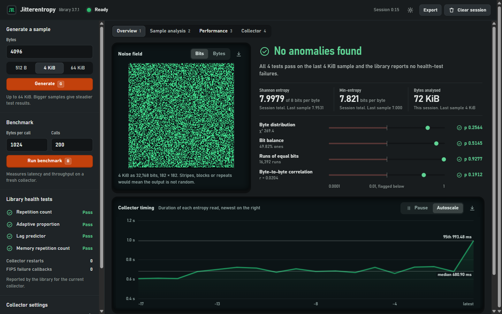
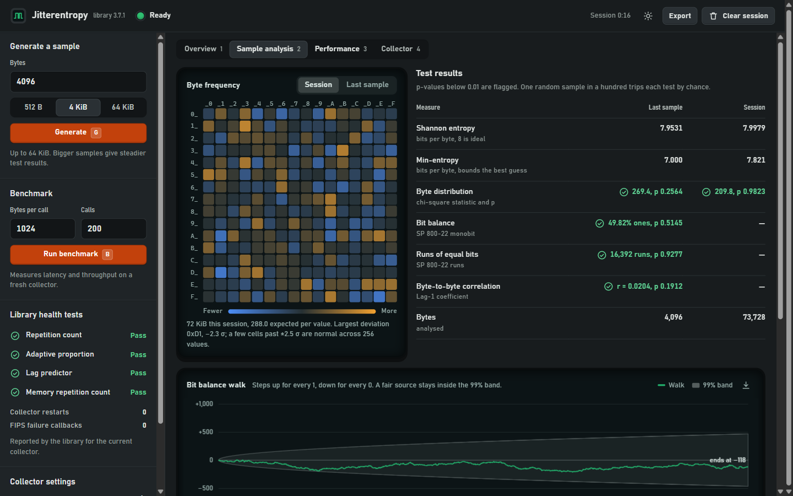
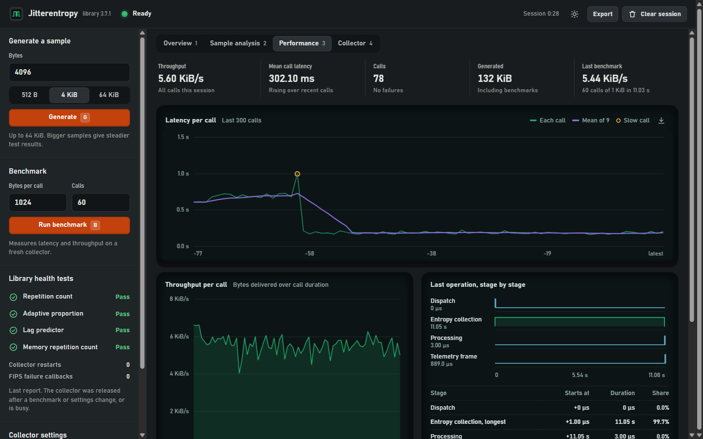
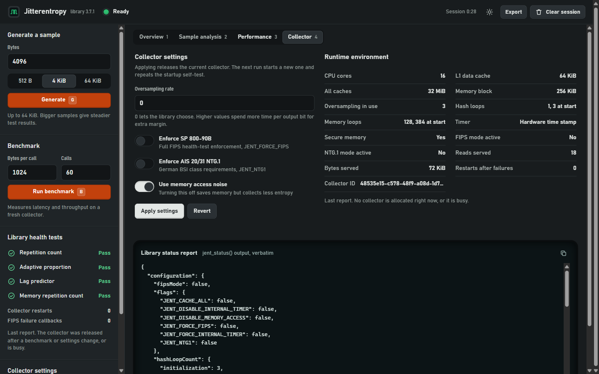

# Jitterentropy Analysis Dashboard

A Windows desktop instrument for the [Jitterentropy](https://github.com/smuellerDD/jitterentropy-library) CPU-timing random number generator. It generates real output from the library, tests it statistically, shows the library's own health-test state, and measures how fast and how steadily the collector runs.



The entropy collection itself is the upstream library by Stephan Müller, vendored unmodified. This repository adds the Windows host, a native telemetry bridge, a statistics engine, and the dashboard.

---

## What it shows

### Overview

The first screen answers one question: does the output look random right now?

- **Noise field.** Every bit of the last sample drawn as one pixel (or every byte as a grey level). A healthy source looks like even static. Stripes, blocks or repeating tiles would be visible at a glance.
- **Verdict.** *No anomalies found*, *Investigate* or *Health failure*, with the reason in one sentence. It combines the library's own health tests with four statistical tests on the last sample.
- **Statistical tests on p-value rulers.** Chi-square byte distribution, SP 800-22 monobit and runs tests, and lag-1 byte correlation. Anything below p = 0.01 is flagged.
- **Session entropy.** Shannon and min-entropy over every byte generated this session, so the estimate converges instead of reflecting one small sample.
- **Collector timing.** A live trace of how long each `jent_read_entropy_safe()` call takes, with median and 95th-percentile lines, pause and autoscale.

### Sample analysis



- **Byte frequency map.** All 256 byte values in a 16 × 16 grid, coloured by how far each one is from its expected count, for the session or the last sample.
- **Bit balance walk.** Steps up for every 1 and down for every 0, drawn against the 99% band a fair coin stays inside.
- **Test table.** Every measure for the last sample and the session side by side.
- **Hex dump** of the full sample, with one-click copy.

### Performance



- Latency of each call with a rolling mean and slow calls marked.
- Throughput of each call, on its own axis.
- A logic-analyser view of the last operation: dispatch, entropy collection, processing and the telemetry frame that delivered the result.
- Session totals, the last benchmark result, and an activity log of every generate, benchmark and settings change.

### Collector



- Change the oversampling rate, SP 800-90B (FIPS) enforcement, AIS 20/31 NTG.1 enforcement and memory-access noise without restarting.
- The runtime environment as the library reports it: CPU cores, cache sizes, memory block, loop counts, timer source.
- The verbatim `jent_status()` report.

### Always visible

- **Library health tests.** Repetition count, adaptive proportion, lag predictor and memory repetition count, as reported by the library for its raw noise source.
- **Job status** with a progress bar and a Stop key for running generates and benchmarks.
- **Light and night themes**, and JSON, CSV and PNG export.

### Keyboard

| Key | Action |
|-----|--------|
| `G` | Generate a sample |
| `B` | Run the benchmark |
| `Esc` | Stop the running job |
| `Space` | Pause the timing trace |
| `1` – `4` | Switch view |

---

## Architecture

```text
 Jitterentropy library (vendored, unmodified)
        │  jent_read_entropy_safe(), jent_status()
        ▼
 rng_wrapper.c        collector lifecycle, settings, per-call timing
 health_monitor.c     counters, 300-call history ring, 256-sample timing ring
 entropy_stats.c      Shannon, min-entropy, chi-square, monobit, runs,
                      serial correlation, SP 800-90B style RCT/APT
        │
        ▼
 main_gui.cpp         worker threads, session histogram, stage timing,
                      JSON telemetry every 30 ms via PostWebMessageAsJson()
        │
        ▼
 gui/index.html       the dashboard (HTML, CSS and vanilla JS in one file)
```

1. Buttons in the page send small JSON commands (`generate`, `benchmark`, `cancelBenchmark`, `configure`, `clearHistory`) through `window.chrome.webview.postMessage()`. The native side validates every field (`bridge_json.h`) and runs jobs on a single worker thread.
2. Each collector call records its own duration; each generate computes a full statistics report on the bytes it produced and adds them to the session histogram.
3. A timer on the UI thread snapshots everything without blocking on the collector, serialises it to JSON and posts it to the page roughly 33 times a second.

---

## Repository structure

```text
├── app/
│   ├── CMakeLists.txt         CLI, GUI and unit-test targets
│   ├── main.c                 CLI entry point
│   ├── main_gui.cpp           Win32 + WebView2 host and telemetry bridge
│   ├── rng_wrapper.c/.h       Jitterentropy wrapper and collector settings
│   ├── health_monitor.c/.h    Counters and history rings
│   ├── entropy_stats.c/.h     Statistics engine (no Windows dependency)
│   ├── benchmark.c/.h         Cancellable benchmark
│   ├── bridge_json.h          Strict parser for inbound bridge messages
│   ├── gui/index.html         The dashboard
│   └── tests/                 Unit tests and GUI integration tests
├── deps/webview2/             Vendored WebView2 SDK
├── docs/screenshots/          README images
└── jitterentropy-library/     Vendored upstream library
```

---

## Building

### Prerequisites

- MinGW-w64 GCC/G++ (tested with 15.2) or another Win32 C/C++ toolchain
- CMake 3.20 or newer
- Microsoft Edge WebView2 Runtime (preinstalled on Windows 11 and Windows 10 21H2+)

### Steps

```powershell
# 1. The vendored library
cmake -S jitterentropy-library -B jitterentropy-library/build -G "MinGW Makefiles"
cmake --build jitterentropy-library/build --target jitterentropy

# 2. The CLI and the dashboard
cmake -S app -B runtime -G "MinGW Makefiles"
cmake --build runtime --target jitterentropy_app jitterentropy_gui --parallel 4

# 3. Run
.\runtime\jitterentropy_gui.exe
```

### Command-line tool

```powershell
.\runtime\jitterentropy_app.exe --bytes 4096 --stats --status
.\runtime\jitterentropy_app.exe --benchmark 1024 1000
```

`--help` lists every option, including `--osr`, `--force-fips`, `--ntg1` and `--no-memory-access`.

---

## Testing

```powershell
# Unit tests: bridge JSON parsing and the statistics engine
cmake --build runtime --target test_bridge_json test_entropy_stats
ctest --test-dir runtime

# Integration tests: drive the real GUI over WebView2's debug port
pip install websockets
python app/tests/gui_bridge_test.py
python app/tests/gui_entropy_stats_test.py
```

The integration tests open the real window and take about a minute each.

---

## A note on the statistics

These are diagnostic tests for an engineering dashboard, not a certified SP 800-90B or FIPS 140 validation. A p-value below 0.01 is worth a second look, and about one random sample in a hundred trips each test by chance. The authoritative health state is the library's own, shown in the left panel. The "timing stream checks" on the Overview apply the same RCT/APT formulas to call durations, a coarse proxy rather than the raw noise source.

---

## Credits

- **Core RNG library:** [Jitterentropy](https://github.com/smuellerDD/jitterentropy-library) by Stephan Müller. All entropy collection, health testing and timing logic belongs to the upstream project.
- **Windows dashboard and instrumentation:** this repository.

## License

- `app/`: [MIT License](LICENSE).
- `jitterentropy-library/`: the upstream terms, dual BSD 3-Clause and GPLv2 (see `jitterentropy-library/LICENSE`).
- `deps/webview2/`: Microsoft's BSD 3-Clause license (see `deps/webview2/LICENSE.txt`).
